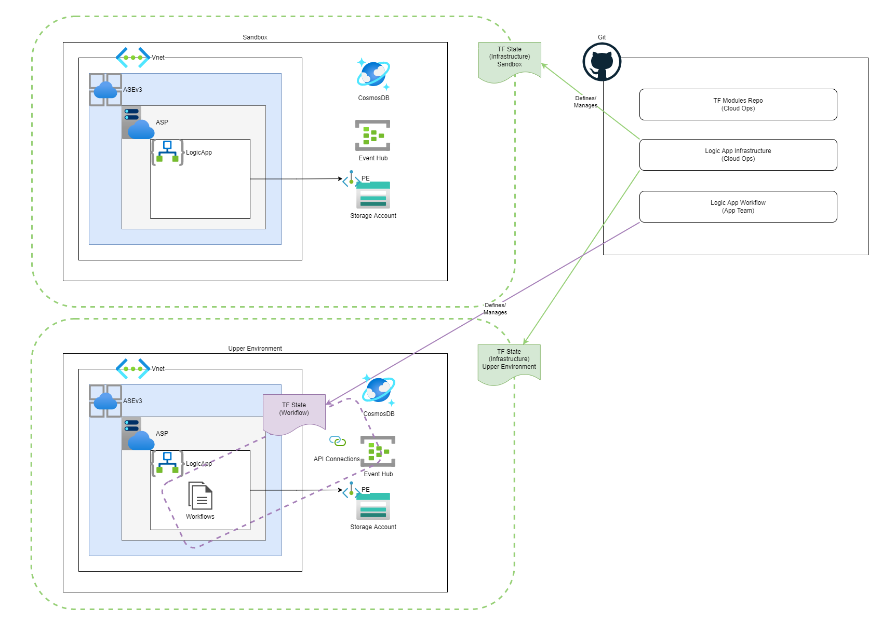

# logicapp-workflows
* This repository is for creating the Logic App Workflows. For Infrastructure please look at [logicapp-infra](https://github.com/implodingduck/logicapp-infra)
* Logic App Workflows Repository that creates the following items:
  * Workflows
  * Connections
  



The Service Provider Connections are maintained in a combination of the [connections.json](./workflows/connections.json) file and app settings defined on the standard logic app

Use the following to loop over the directories that container a workflow.json file and upload them into the storage account file share via terraform:
```
resource "azurerm_storage_share_directory" "workflows" {
  for_each = fileset("../workflows", "**/workflow.json")
  name             = "site/wwwroot/${split("/", each.value)[0]}"
  storage_account_name = data.azurerm_storage_share.share.storage_account_name
  share_name = data.azurerm_storage_share.share.name
}

resource "azurerm_storage_share_file" "workflows" {
  depends_on = [
    azurerm_storage_share_directory.workflows
  ]
  for_each = fileset("../workflows", "**/workflow.json")
  name             = "workflow.json"
  path             = "site/wwwroot/${split("/", each.value)[0]}"
  storage_share_id = data.azurerm_storage_share.share.id
  source           = "../workflows/${each.value}"
  content_md5      = filemd5("../workflows/${each.value}")
}
```

